<!-- **bold**, _italic_, ~~strikethrough~~ or `keyword`. -->
<!-- [Link to another page](./another-page.html). -->

# **3-Tier Architecture Application Developing using Docker**

Follow my GitHub Account: [Raj Randive](https://github.com/Raj-Randive)

## Prerequisites

---

- System: Ubuntu 22.04.4 LTS (Jammy Jellyfish)
- Install "Docker" on your machine. For installing Docker, visit: [Official Documentation](https://docs.docker.com/engine/install/ubuntu/)

## Overview:

---

My project implements a 3-tier architecture using Docker containers. The architecture consists of:

- Sample-App container: Hosts the application logic.
- mongo-express container: Provides a user-friendly interface for MongoDB.
- MongoDB container: Houses the database.

This app shows a simple user profile app set up using

1. index.html with pure js and css styles
2. nodejs backend with express module
3. mongodb for data storage

This modular setup enables independent scaling, ensures consistent deployment across environments, and simplifies maintenance tasks, laying a solid foundation for scalable and efficient application deployment.

## Step 1. Create a docker network for container isolation.

```js
// Docker Command
docker network create <network-name>
```

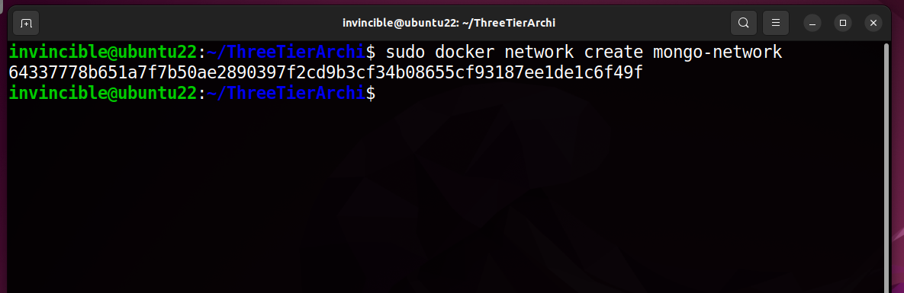

## Step 2. Check if the network is created correctly.

```js
// Docker Command
docker network ls
```

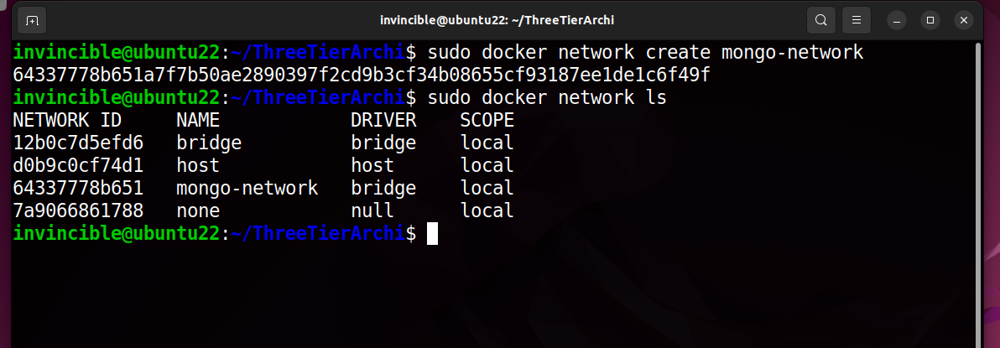

## Step 3. Create "mongodb" container using following command

```js
// Docker Command
docker run -p 27017:27017 -e MONGO_INIT_ROOT_USERNAME=admin -e MONGO_INIT_ROOT_USERNAME=password --net mongo-network --name=mongodb -d mongo
```

- 27017 is by default port for mongodb container (refer mongodb DockerHub repository for more details).
- -e flag is for environment variables.
- We are spinning the container inside our mongo-network.
- Select the image "mongo". If no tag is passed, by default it takes latest tag.
- Check the spinned container "via docker ps" command.


## Step 4. Create "mongo-express" container which is used to manage the mongo database using following command.

```js
// Docker Command
docker run -p 8081:8081 -e ME_CONFIG_MONGODB_ADMINUSERNAME=admin -e ME_CONFIG_MONGODB_ADMINPASSWORD=password -e ME_CONFIG_MONGODB_SERVER=mongodb --network=mongo-network --name=mongo-express -d mongo-express
```

- 8081 is by default port for mongo-express container (refer mongo-express DockerHub repository for more details).
- -e flag is for environment variables.
- We are spinning the container inside our mongo-network.
- Refer DockerHub mongo-express Repository to get all the necessary environment variables.
- Select the image "mongo-express". If no tag is passed, by default it takes latest tag.
- Check the spinned container via "docker ps" command.

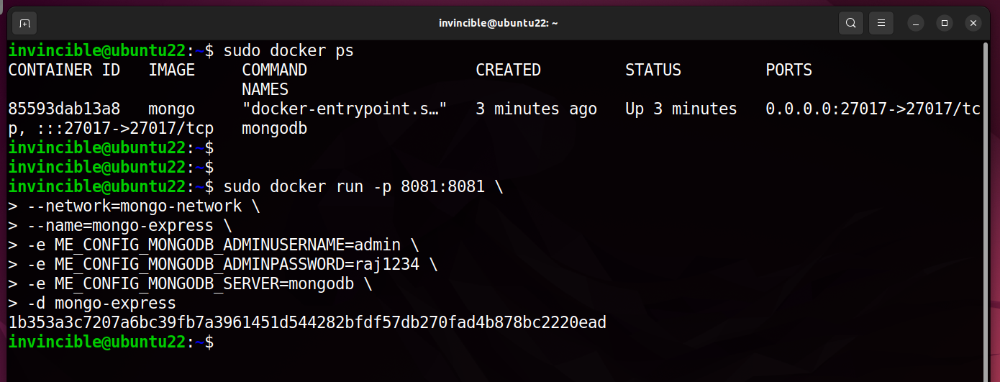

## Step 5. Open http://localhost:8081 and create two databases for our Sample-App.

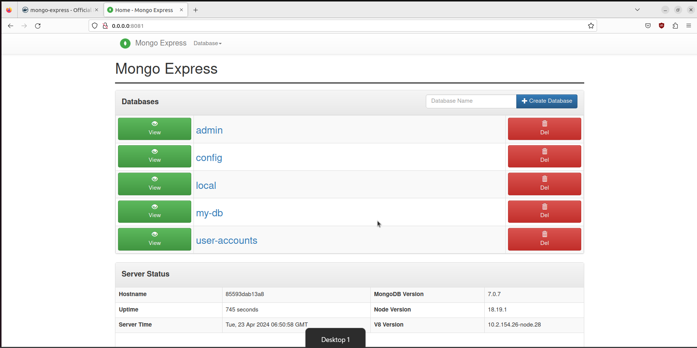

## Step 6. Create a "user" collection inside our user-accounts database for our Sample-App which we are going to run soon.

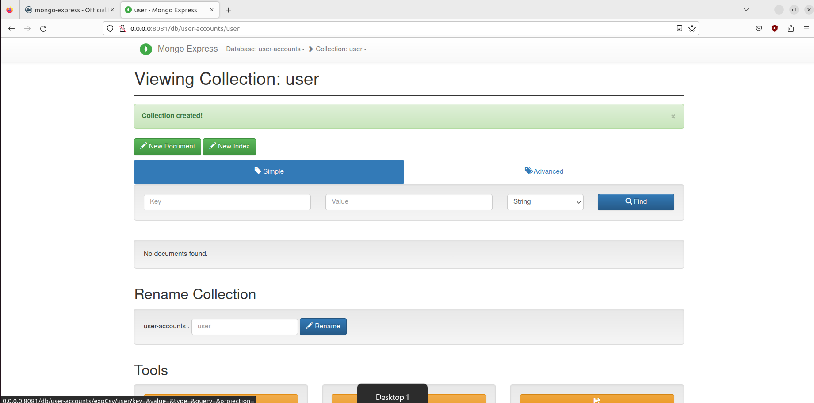

## Step 7. Now clone the Sample-App on to your system and change the directory to app.

- You can clone the Sample-App from here: [Github Link - Raj Randive](https://github.com/Raj-Randive/3-Tier-Architecture-Docker).

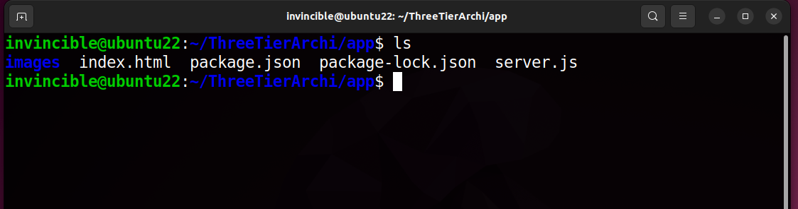

## Step 8. Create a Dockerfile for our Sample-App

```js
// Docker Command
From node
WORKDIR /app
COPY . .
ENV MONGO_DB_USERNAME=admin
ENV MONGO_DB_PWD=password
RUN npm install
EXPOSE 3000
CMD ["node", "server.js"]
```

- We are using "node" image.
- Initialize the working directory as "/app" or give any other working dir.
- Give the environment variables i.e., username and passwords for our App to run.
- Open port 3000 as mentioned in our Sample-App.
- At last Run "node server.js" using CMD option.

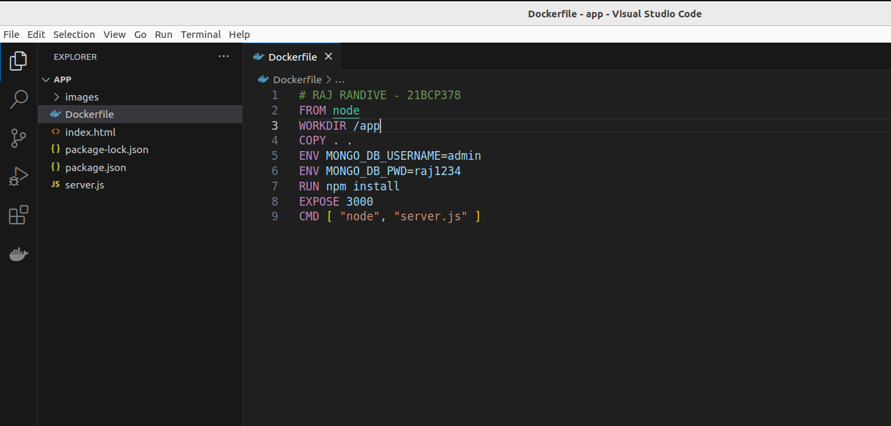

## Step 9. Change the admin and password you gave earlier in the "server.js" file.

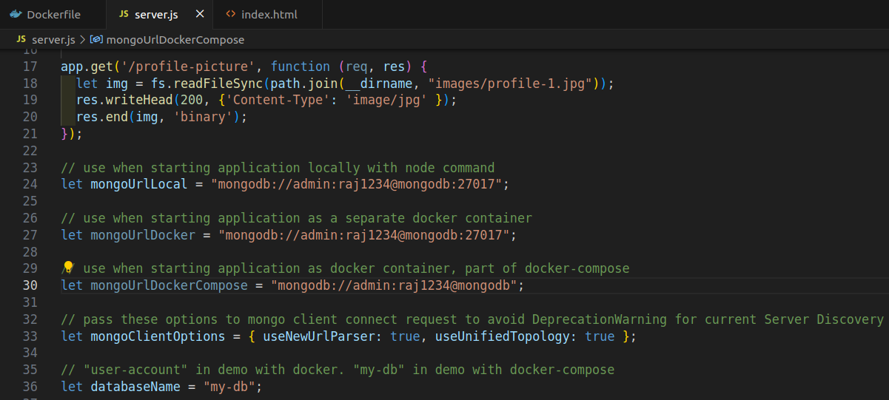

## Step 10. Check for the already created Images using following command.

```js
// Docker Command
docker images
```

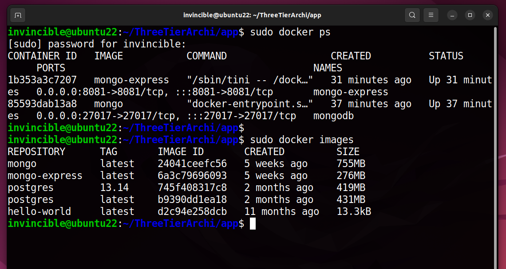

## Step 11. Create the image for our Sample-App using the docker build command.

```js
// Docker Command
docker build -t <our-sample-app-name> .
```

- "-t" is for tagging our Sample-App image.
- We have added "." at the end because our dockerfile is in current directory where we are standing right now i.e., inside app folder.

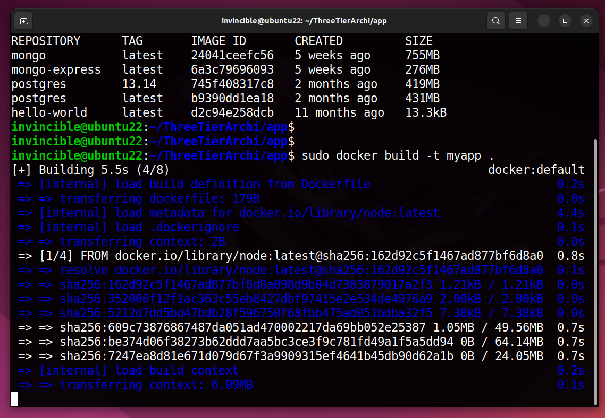

## Step 12. Confirm the created image using following command.

```js
// Docker Command
docker images
```

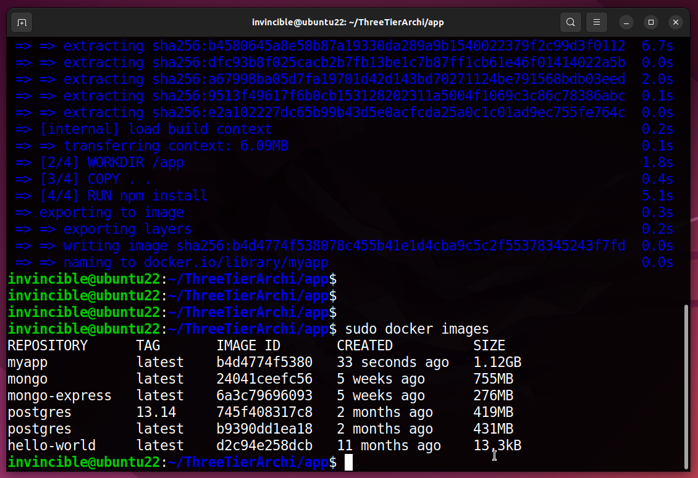

## Step 13. Now create a container out of the Sample-App Image using following command.

```js
// Docker Command
docker run -d -p 3000:3000 --network=mongo-network <sample-app-name>
```

- "-d" is to spin the container in detached mode.
- Check the running container using "docker ps" command.
- We can see now we have 3 containers running.
  - First: Our Sample-App running.
  - Second: mongo-express container.
  - Third: mongodb container (database).

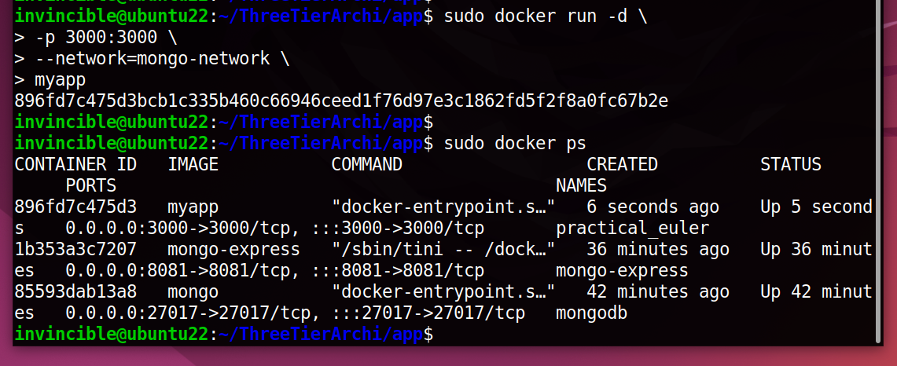

## Step 14. Open http://locahost:3000 to see our Sample-App home page.

- Click "Edit Profile" button and update the details. It will save the information on to our database.

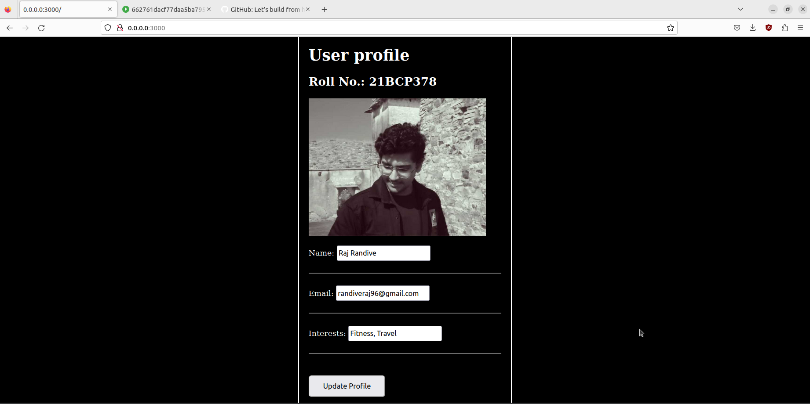

## Step 15. After updating the details.

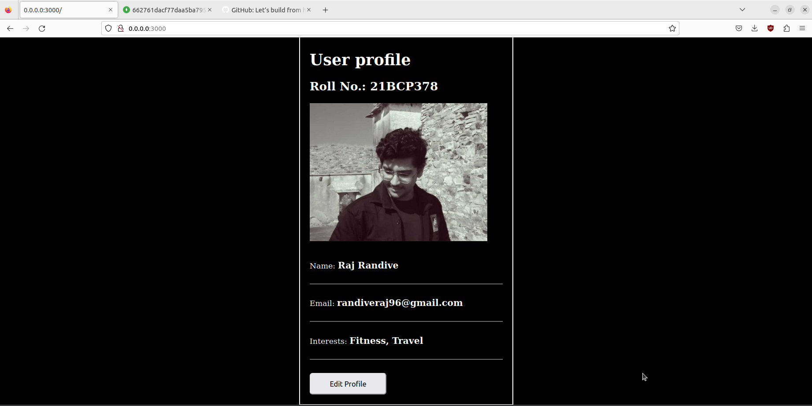

## Step 16. Go to our "users" collection to verify our data.

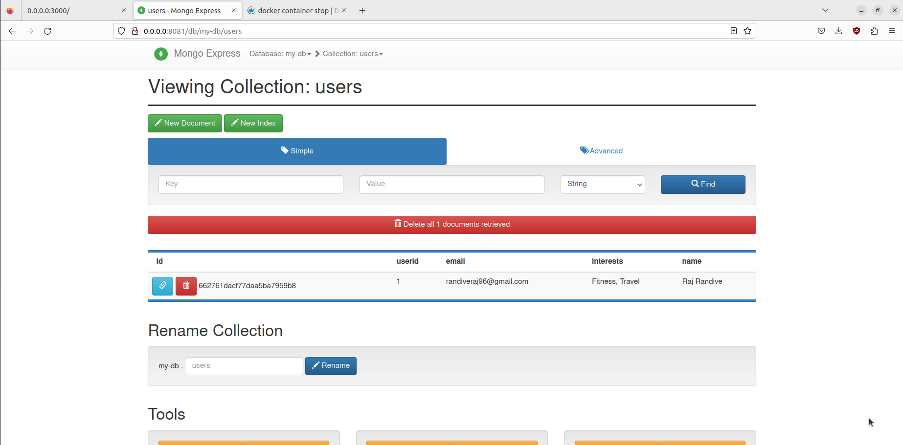

## Step 17. Click on the "userid" to see more detailed info about that user.

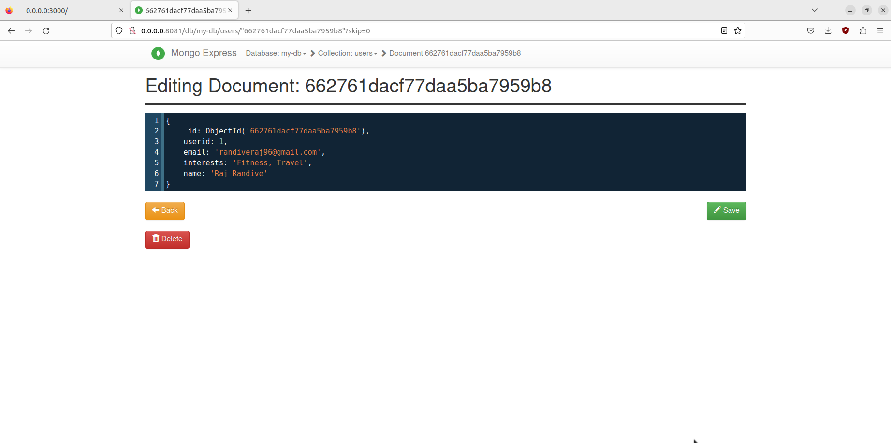

<!--  -->
<!--  -->

---

> ### **Key Features and Benefits:**

> **Modularity:** Each tier of our architecture is encapsulated within its own Docker container, allowing for independent scaling and management.

> **Scalability:** With Docker's orchestration tools like Docker Swarm or Kubernetes, scaling our application horizontally becomes seamless and efficient.

> **Portability:** Docker containers are highly portable, enabling consistent deployment across different environments, from development to production.

> **Ease of Management:** Docker's containerization simplifies deployment, configuration, and maintenance tasks, reducing overhead and enhancing operational efficiency.

> **Flexibility:** By decoupling the application logic, database, and user interface into separate tiers, our architecture offers flexibility for future enhancements and modifications.

<!--  -->

> ### **Conclusion**:

> By adopting a 3-tier architecture with Docker, we've created a scalable and resilient foundation for deploying modern applications. Whether you're building a small-scale prototype or a large-scale production system, leveraging containerization can streamline your development and deployment workflows, empowering you to focus on delivering value to your users..

<!--  -->
<!--  -->

---

<!-- ###### Header 6

| head1        | head two          | three |
| :----------- | :---------------- | :---- |
| ok           | good swedish fish | nice  |
| out of stock | good and plenty   | nice  |
| ok           | good `oreos`      | hmm   |
| ok           | good `zoute` drop | yumm  | -->

### Name: Raj Randive (21BCP378)

_Written on April 23, 2024_
